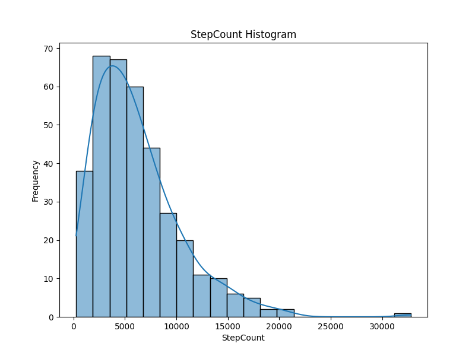
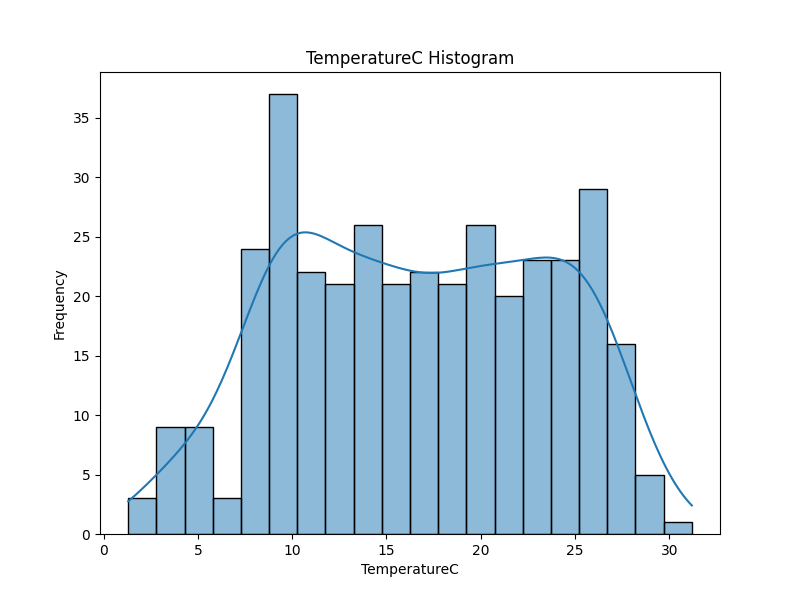
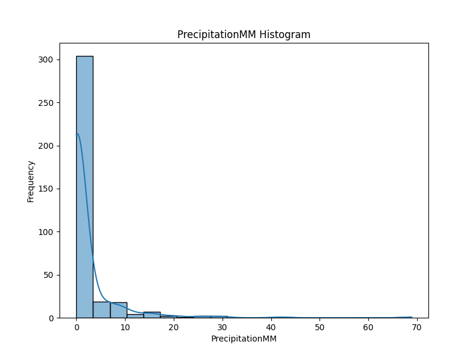
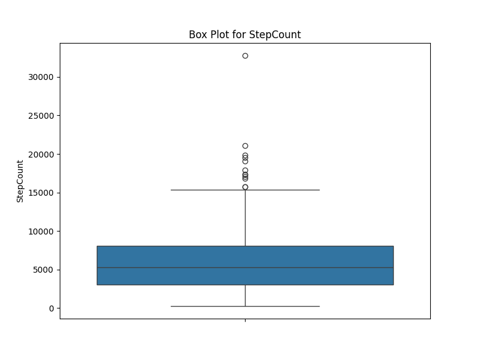
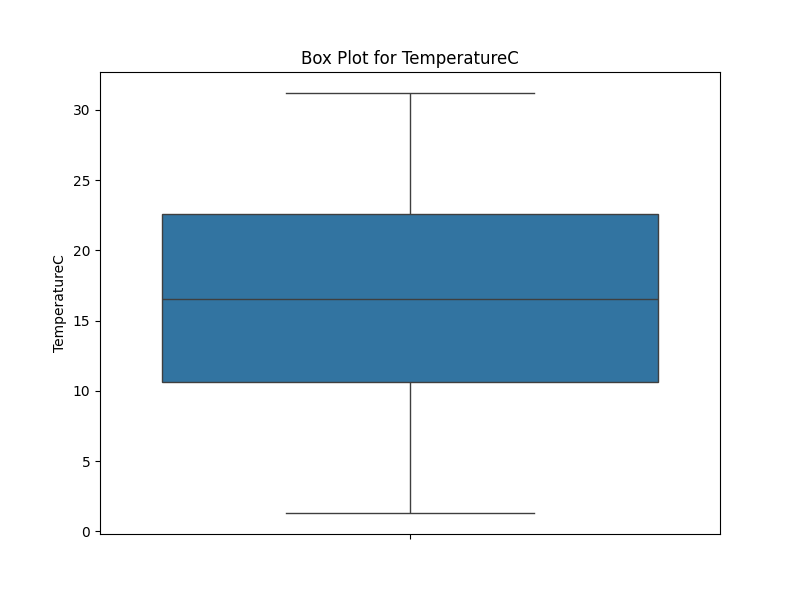
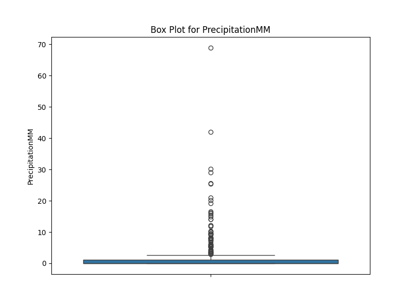
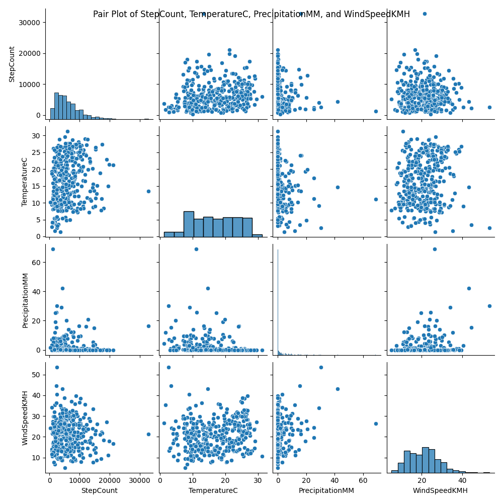
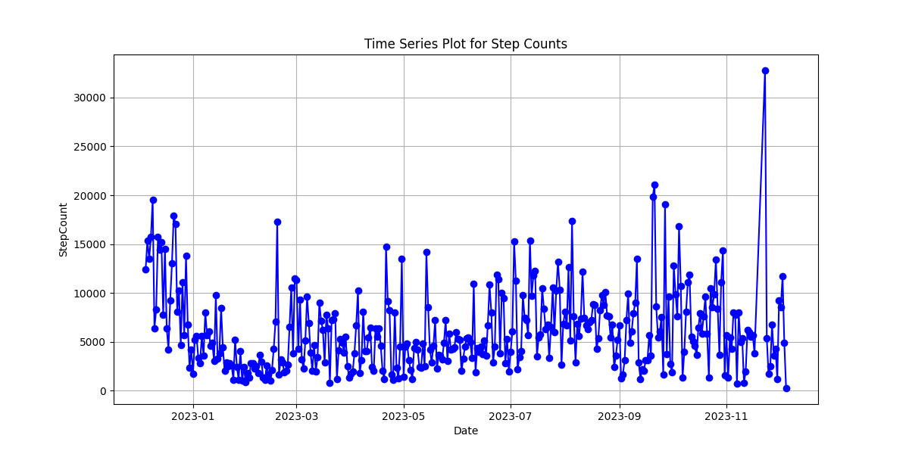
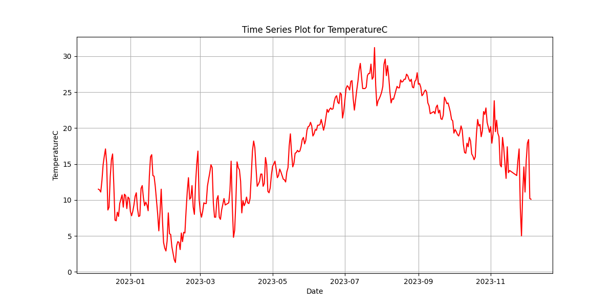
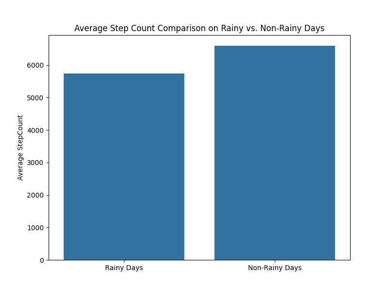

# Step Count and Weather Analysis Project

## Project Overview

This project aims to explore the relationship between daily step counts and various weather conditions, such as temperature, precipitation, and wind speed. The primary hypothesis is that weather conditions significantly influence the number of steps taken daily.

## Hypothesis

"The number of daily steps taken is influenced by the day's weather conditions, specifically temperature and precipitation."

## Data Description

The dataset includes daily step count data merged with daily weather conditions (temperature, precipitation, wind speed) over a specified period.

## Exploratory Data Analysis (EDA) Steps

### 1. Initial Data Examination

To begin our exploratory data analysis (EDA), we conducted an initial examination of the dataset to ensure data quality and get a sense of its structure. Below are the key findings from this examination:

- #### Missing Values

  - There are no missing values in the dataset for any of the columns, including `Date`, `StepCount`, `TemperatureC`, `PrecipitationMM`, and `WindSpeedKMH`.

- #### Data Types

  - The `Date` column is correctly recognized as a `datetime64[ns]` data type, suitable for representing date values.
  - `StepCount` is of type `int64`, which is appropriate for counting daily steps.
  - `TemperatureC`, `PrecipitationMM`, and `WindSpeedKMH` are recognized as `float64`, indicating that these columns contain decimal values for temperature, precipitation, and wind speed, respectively.

  This initial examination assures us that the dataset is well-structured and free from missing values, setting a solid foundation for our further exploratory analysis. We will now proceed to explore the data in more depth to uncover patterns and insights related to step counts and weather conditions.

### 2. Univariate Analysis

- #### Analyze the Distribution of Each Variable

  - ##### StepCount

    We examined the distribution of daily step counts using a histogram. The histogram below shows the frequency distribution of step counts.

    

  - ##### TemperatureC

    We visualized the distribution of daily temperatures with a histogram, providing insights into temperature patterns over time.

    

  - ##### PrecipitationMM

    The histogram for daily precipitation levels reveals the frequency and magnitude of precipitation events.

    

  - ##### WindSpeedKMH

    We created a histogram to explore the distribution of daily wind speeds and identify windy days.

    

- #### Identify Outliers

  To identify outliers, we used box plots for each variable. Box plots provide a visual representation of data distribution, including potential outliers.

  

  

  

  

### 3. Bivariate/Multivariate Analysis

In the Bivariate/Multivariate Analysis phase of our EDA, we aim to explore relationships between variables and identify potential patterns and correlations within the dataset. Here are the key tasks we conducted:

#### Perform Correlation Analysis

- ##### Correlation Matrix

  We computed the correlation matrix to quantify the relationships between variables. The correlation coefficient measures the strength and direction of linear relationships between pairs of variables. Below is the correlation matrix heatmap that illustrates the correlations between our key variables.

  

#### Create Scatter Plots and Pair Plots

- ##### Scatter Plots

  We generated scatter plots to visually explore relationships between specific pairs of variables. Scatter plots help us identify potential trends and patterns in the data.

  Example: Scatter plot of `StepCount` vs. `TemperatureC`

  

- ##### Pair Plots

  Pair plots are useful for visualizing relationships between multiple variables simultaneously. They provide insights into how variables interact with each other.

  Example: Pair plot of `StepCount`, `TemperatureC`, `PrecipitationMM`, and `WindSpeedKMH`

  

In this phase, we aim to uncover valuable insights and correlations that will guide our further analysis and hypothesis testing.

### 4. Time Series Analysis

Time series analysis involves examining data points collected or recorded at successive and equally spaced time intervals. In this phase of our EDA, we focused on understanding trends, patterns, and variations over time. Here are the key tasks we conducted:

#### Observe Trends and Seasonal Variations in Step Counts

- ##### Time Series Plot for Step Counts

  We created a time series plot of daily step counts to visualize trends and seasonality. Time series plots help us identify patterns that repeat over time, such as daily, weekly, or monthly trends.

  

#### Analyze Weather Patterns Over Time

- ##### Time Series Plots for Weather Variables

  Similarly, we generated time series plots for weather-related variables, including temperature, precipitation, and wind speed. These plots allow us to observe how weather conditions change over time.

  Example: Time series plot for TemperatureC

  

By conducting time series analysis, we gain insights into how step counts and weather conditions evolve over time. This knowledge can help us uncover long-term trends and seasonal variations that may influence physical activity.

### 5. Grouped Analysis

Grouped analysis involves categorizing data into groups based on specific criteria and then comparing or analyzing the data within those groups. In this phase of our EDA, we performed grouped analysis to gain insights into how weather conditions and seasons impact step counts. Here are the key tasks we conducted:

#### Group Data by Weather Conditions

- ##### Comparison of Step Counts on Rainy vs. Non-Rainy Days

  We categorized the data into two groups: rainy days and non-rainy days, based on precipitation levels. By comparing step counts on these different weather conditions, we aimed to understand how rain affects physical activity.

  Example: Box plot comparing step counts on rainy vs. non-rainy days

  

By conducting grouped analysis, we can uncover valuable insights into how weather conditions influence physical activity levels.

### 6. Hypothesis Testing

In the Hypothesis Testing phase, we conducted statistical tests to validate hypotheses related to step counts and their relationships with weather conditions. Here are the specific hypotheses we tested and the corresponding results:

#### Hypotheses Tested

1.  **Hypothesis 1:** There is no significant difference in average step counts between rainy and non-rainy days.

- T-Statistic: -1.9316
- P-Value: 0.0542

2.  **Hypothesis 2:** Temperature significantly impacts step counts (Positive Correlation).

- Pearson Correlation Coefficient: 0.1921
- P-Value: 0.0002

#### Interpretation of Results

- ##### Hypothesis 1 Testing (Rainy vs. Non-Rainy Days)

  For Hypothesis 1, we tested whether there is a significant difference in average step counts between rainy and non-rainy days. The results indicate the following:

  - Null Hypothesis (H0): There is no significant difference in average step counts.
  - Alternative Hypothesis (H1): There is a significant difference in average step counts.
  - With a p-value of 0.0542 (greater than 0.05), we fail to reject the null hypothesis. This suggests that there is no significant difference in average step counts between rainy and non-rainy days.

- ##### Hypothesis 2 Testing (Temperature vs. Step Counts)
  For Hypothesis 2, we examined the relationship between temperature and step counts. The results show the following:
  - Null Hypothesis (H0): Temperature does not significantly impact step counts (No Correlation).
  - Alternative Hypothesis (H1): Temperature significantly impacts step counts (Positive Correlation).
  - The Pearson Correlation Coefficient is 0.1921, and the p-value is 0.0002 (less than 0.05). Therefore, we reject the null hypothesis, indicating a statistically significant positive correlation between temperature and step counts. Higher temperatures are associated with more steps.

These results provide valuable insights into how weather conditions and temperature influence step counts. While there is no significant difference in step counts between rainy and non-rainy days, temperature does have a significant impact on step counts, with higher temperatures leading to more steps.

In the next phases of our analysis, we will further explore trends, seasonal variations, and grouped analysis to gain a comprehensive understanding of the data.

### 7. Addressing Anomalies

In this phase, we focus on identifying and understanding anomalies or outliers in our dataset. Anomalies are data points that significantly deviate from the norm and can sometimes provide valuable insights or indicate data quality issues. Here's how we address this aspect:

#### Anomaly Detection

We employed various techniques to detect anomalies or outliers in the data, including visualization, statistical methods, and machine learning models. Two methods, the Z-Score method and Isolation Forest, were applied to our dataset to identify anomalies.

- ##### Z-Score Anomaly Detection

  The Z-Score method identified the following anomalies in our data:

  - Date: 2022-12-09, StepCount: 19555
  - Date: 2023-09-20, StepCount: 19817
  - Date: 2023-09-21, StepCount: 21075
  - Date: 2023-09-27, StepCount: 19037
  - Date: 2023-11-23, StepCount: 32773

- ##### Isolation Forest Anomaly Detection
  The Isolation Forest method detected the following anomalies in our data:
  - Date: 2022-12-08, StepCount: 15715
  - Date: 2022-12-09, StepCount: 19555
  - Date: 2022-12-12, StepCount: 15720
  - Date: 2022-12-14, StepCount: 15194
  - Date: 2022-12-21, StepCount: 17902
  - Date: 2022-12-22, StepCount: 17055
  - Date: 2023-02-18, StepCount: 17325
  - Date: 2023-03-20, StepCount: 811
  - Date: 2023-04-21, StepCount: 14753
  - Date: 2023-08-05, StepCount: 17402
  - Date: 2023-09-20, StepCount: 19817
  - Date: 2023-09-21, StepCount: 21075
  - Date: 2023-09-27, StepCount: 19037
  - Date: 2023-10-05, StepCount: 16824
  - Date: 2023-11-07, StepCount: 752
  - Date: 2023-11-11, StepCount: 831
  - Date: 2023-11-23, StepCount: 32773
  - Date: 2023-12-05, StepCount: 263

### 8. Data Quality Check

In this phase, we focus on ensuring the accuracy and consistency of our dataset. Data quality is crucial for reliable analysis and valid conclusions. Here are the findings from our data quality check:

#### Missing Values

- **No Missing Data:** We have confirmed that there are no missing values in any of the columns in the dataset. This is a positive sign as it indicates that the dataset is complete, and no data imputation is required.

#### Data Types

- **Consistent Data Types:** The data types of each column are consistent with their respective attributes. Date is in the `datetime64[ns]` format, and the other numerical attributes have the appropriate data types.

#### Duplicate Rows

- **No Duplicate Rows:** There are no duplicate rows in the dataset. Each row is unique, which is essential for accurate analysis.

## Tools and Libraries

- `pandas`: Utilized for data manipulation, providing powerful data structures and functions.
- `xml.etree.ElementTree`: Employed for parsing XML data, enabling us to extract information from structured XML files.
- `datetime`: Used for working with dates and times, facilitating date-related data handling.
- `matplotlib.pyplot`: Employed for creating visualizations and plots to aid in data exploration.
- `seaborn`: Utilized to enhance the style and aesthetics of plots, making them more visually appealing.
- `scipy.stats.ttest_ind`: Applied for conducting t-tests, which are valuable for hypothesis testing in statistical analysis.
- `scipy.stats.pearsonr`: Used for calculating Pearson correlation coefficients to measure the strength and direction of relationships between variables.
- `numpy`: Leveraged for numerical operations and array handling, providing efficient tools for mathematical computations.
- `scipy.stats`: Offers additional statistical functions to support various analytical tasks.
- `sklearn.ensemble.IsolationForest`: Utilized for anomaly detection using the Isolation Forest algorithm, helping identify unusual data points.
